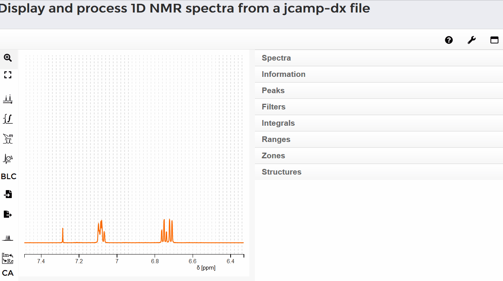

#### Select a single signal

To select a single signal, click the "peaks picking" button. Move the mouse to the selected signal and click on it with the left mouse button. The peak shift appears over the signal. The exact value of the signal can be found in a table on the right side of the interface under the "peaks" tab.

#### Automatic single peak picking

You mark a signal by simultaneously holding down the shift key and the left mouse button and moving the mouse over the range of the signal. After releasing both keys, the shift of the signal appears. On the right side of the screen, under the "Peaks" tab, a list of all selected signals is listed. If you move the mouse over the shift of the signal in the spectrum, the corresponding entry is displayed in the list. A signal is listed for the range that has been marked with the mouse: The range is stored as a multiplet, which has to be analyzed more precisely with "range peaking". If you move the mouse over a certain line in the list, the corresponding shift in the spectrum is marked.

